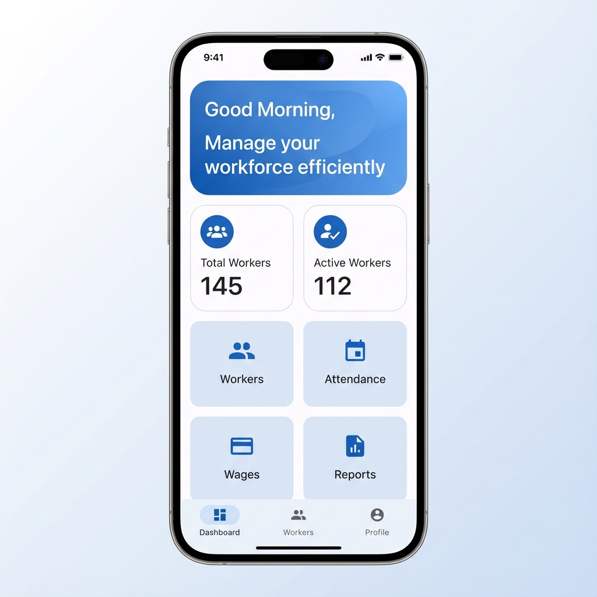

#  Laborbook - Offline Worker Management

[](https://flutter.dev)
[](https://www.sqlite.org/)
[]()
[]()

**Laborbook** is a premium, 100% offline worker management solution built with Flutter. Designed for contractors, site managers, and small business owners, it simplifies the complex task of tracking attendance, calculating wages, and managing worker payments—all without requiring an internet connection.

---

## 📸 App Screenshots

<p align="center">
  
</p>

---

## ✨ Why Laborbook?

Managing daily-wage workers can be chaotic. **Laborbook** brings order to the chaos with:

*   **🔒 Privacy First:** All data is stored locally on your device using SQLite. No cloud, no tracking.
*   **⚡ Lightning Fast:** Highly optimized UI using Material 3 and Provider for a smooth experience.
*   **📂 PDF Reports:** Generate professional wage slips and attendance reports in seconds.
*   **🛠️ Offline Capability:** Works perfectly in remote sites with zero connectivity.

---

## 🚀 Getting Started (Setup Guide)

Follow these steps to set up the project on your local machine.

### 1. Prerequisites
Before you begin, ensure you have the following installed:
*   [Flutter SDK](https://docs.flutter.dev/get-started/install) (v3.10.4 or higher)
*   [Dart SDK](https://dart.dev/get-started/sdk/install)
*   Android Studio / VS Code with Flutter extension
*   Java Development Kit (JDK) 11+ (for Android builds)

### 2. Download Project
```bash
# Navigate to your workspace
cd d:\App\attendance
```

### 3. Install Dependencies
Run the following command to fetch all required packages:
```bash
flutter pub get
```

### 4. Database Setup
The app uses SQLite via `sqflite`. No manual database setup is required. The database schema will be automatically initialized when you first launch the app.

### 5. Running the App
Connect your physical device or start an emulator and run:
```bash
flutter run
```

---

## 🛠️ Tech Stack & Architecture

*   **Framework:** [Flutter](https://flutter.dev/) (UI & Logic)
*   **Database:** [SQLite](https://pub.dev/packages/sqflite) (Local Storage)
*   **State Management:** [Provider](https://pub.dev/packages/provider)
*   **PDF Logic:** [pdf](https://pub.dev/packages/pdf) & [printing](https://pub.dev/packages/printing)
*   **UI Style:** Material 3 with Custom Gradients

### Project Organization
```text
lib/
├── database/     # SQLite Database Helper & Schema
├── models/       # Data entities (Worker, Attendance, Payment)
├── services/     # Business logic & Calculations
├── providers/    # App state management
└── screens/      # High-performance UI views
```

---

## 📈 Wage Calculation Logic

Laborbook uses a precise calculation engine to ensure accurate payments:

| Type | Rate | Description |
| :--- | :--- | :--- |
| **Present** | 100% | Full daily wage applied |
| **Half-day** | 50% | Half of the daily wage applied |
| **Overtime** | 1.5x | Calculated per hour (Base: 8h/day) |
| **Absent** | 0% | No wage deducted from balance |

**Formula:**  
`Net Wage = (Total Days × Daily Wage) + (OT Hours × OT Rate) - Advances`

---

## 🗄️ Database Schema

### Workers Table
```sql
CREATE TABLE workers (
  id INTEGER PRIMARY KEY AUTOINCREMENT,
  name TEXT NOT NULL,
  phone TEXT,
  job_type TEXT NOT NULL,
  daily_wage REAL NOT NULL,
  join_date TEXT NOT NULL,
  photo_path TEXT,
  is_active INTEGER NOT NULL DEFAULT 1
);
```

### Attendance Table
```sql
CREATE TABLE attendance (
  id INTEGER PRIMARY KEY AUTOINCREMENT,
  worker_id INTEGER NOT NULL,
  date TEXT NOT NULL,
  status TEXT NOT NULL,
  overtime_hours REAL DEFAULT 0,
  FOREIGN KEY (worker_id) REFERENCES workers (id) ON DELETE CASCADE
);
```

---

## 📦 Build Instructions

### Android (APK)
```bash
# For a production-ready APK
flutter build apk --release --split-per-abi
```
The APK will be available at: `build/app/outputs/flutter-apk/app-release.apk`

---

## 🐛 Troubleshooting

*   **Pub Get Failed:** Run `flutter clean` then `flutter pub get`.
*   **Gradle Error:** Ensure your `android/build.gradle` matches your Flutter version requirements.
*   **Icon Missing:** Ensure `assets/readme/icon.png` is placed correctly.

---

## 📞 Support & Credits

Built with ❤️ by **Antigravity**.  
*For support or queries, please open an issue in the repository.*

---

**Version:** 1.0.0 | **Last Updated:** Jan 2026
